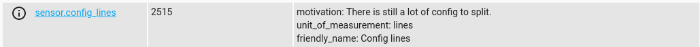

# ha-config-lines
Creates a sensor that shows the number of lines in your home-assistant config and motivates to clean it.

## Installation
Download and copy the "config_lines" folder and place it in the custom_components folder in HA.

## Configuration
Once installed add a sensor with platform config_lines.
```
sensor:
  platform: config_lines
```

## Example

